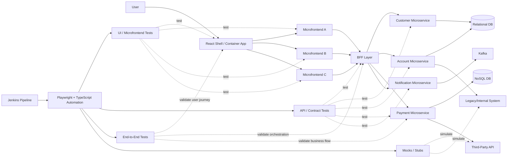

```mermaid
flowchart LR

    U[User] --> FE[React Shell / Container App]

    FE --> MFA[Microfrontend A]
    FE --> MFB[Microfrontend B]
    FE --> MFC[Microfrontend C]

    MFA --> BFF[BFF Layer]
    MFB --> BFF
    MFC --> BFF

    BFF --> MS1[Customer Microservice]
    BFF --> MS2[Account Microservice]
    BFF --> MS3[Payment Microservice]
    BFF --> MS4[Notification Microservice]

    MS1 --> RDB[(Relational DB)]
    MS2 --> RDB
    MS3 --> NDB[(NoSQL DB)]
    MS4 --> KAFKA[Kafka]

    MS3 --> TP[Third-Party API]
    MS2 --> LEG[Legacy/Internal System]

    JEN[Jenkins Pipeline] --> TEST[Playwright + TypeScript Automation]
    TEST --> UIT[UI / Microfrontend Tests]
    TEST --> APIT[API / Contract Tests]
    TEST --> E2ET[End-to-End Tests]
    TEST --> MOCK[Mocks / Stubs]

    UIT -. test .-> FE
    UIT -. test .-> MFA
    UIT -. test .-> MFB
    UIT -. test .-> MFC

    APIT -. test .-> BFF
    APIT -. test .-> MS1
    APIT -. test .-> MS2
    APIT -. test .-> MS3
    APIT -. test .-> MS4

    E2ET -. validate user journey .-> FE
    E2ET -. validate orchestration .-> BFF
    E2ET -. validate business flow .-> MS3

    MOCK -. simulate .-> TP
    MOCK -. simulate .-> LEG
```
